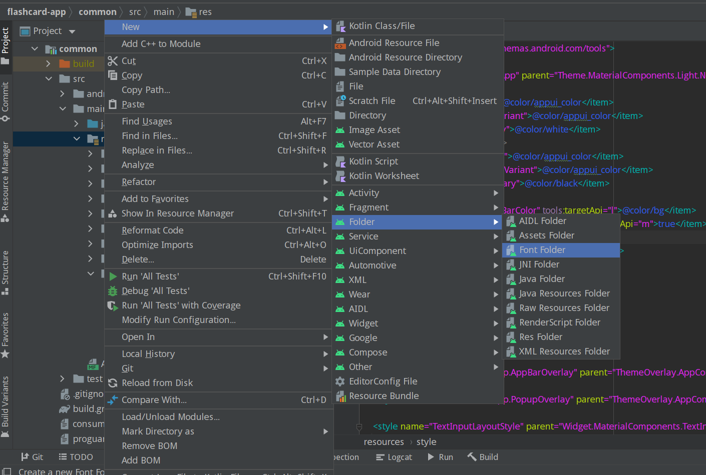
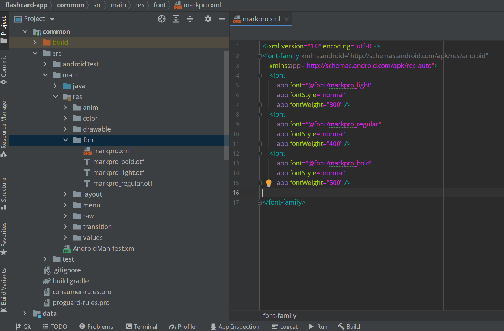
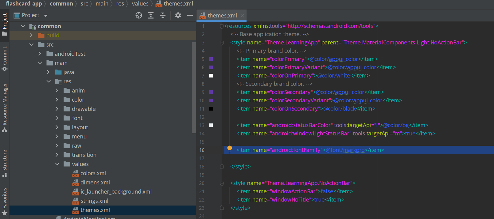

# AppUI Sample Application
This is an open-source project to display how you can create your own custom AppUI application within a few minutes.
I have already created an AppUI [click to see Sample AppUi on your browser](https://app.formaloo.net/YD7L3lG1LVFELz1).

You can also [download](https://drive.google.com/file/d/1mV4_X5USb8BGqYjaZRm4vepN7xdzKMYX/view?usp=sharing)  and install  the demo application.

Clone this repository and import it into **Android Studio**

git clone https://github.com/formaloo/formaloo-android-appui.git

First of all, we need X-API-KEY.

You can find your X-API-KEY on your [CDP Dashboard](https://cdp.formaloo.net/) and create a Connection to get your API_KEY.

Now you just need one more key: The appUI address code. Copy the code at the end of the URL. For instance in this URL  https://app.formaloo.net/YD7L3lG1LVFELz1 the appUI address code is YD7L3lG1LVFELz1.

Copy these two keys and paste them in the api.propertise.txt file inside  your android project:

Now Define build configuration fields in the Gradle file. These constants will be accessible at runtime as static fields of the BuildConfig class:

Your Application is almost ready.

You just need some customization like colors, app name, etc.
If you are new to android you can use following steps to customize your project:

# Color, name
Find the res/value folder under the common module and open the color file to change app primary color that uses appui_color:

in that folder, we have also another file named strings, you can find app-name and change the name of your application.

# Font

To change the font we need a font folder in the res folder under the common module. Paste font files into the font folder. in the res folder there is another file named theme. Open them and change font family.
Check the image for the entire steps:

# Application id
The last item you need to change to have your own application is the package name and application id, follow the images to rename the ids:

1. 
2. 

We are done, our appUI is ready :)
Run the project and test the application.

# AppUI API
If you want to play with AppUI API and have a more desired application you can find endpoints inside BoardsService under the data/remote module.

You can also use the postman collection that shows endpoints responses data.
Just copy this [link](https://www.getpostman.com/collections/5d147bf0893a9f43c892) and import the APPUI collection to your workspace:    

